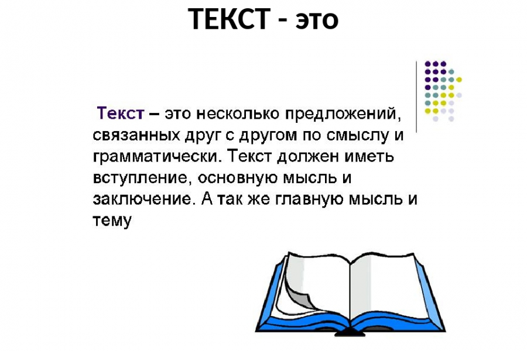

# automation_qa_course

cntrl+'   (сохранить в html)
### Заголовок 3
## Заголовок 2

# Заголовок 1
#### Заголовок 4
###### Заголвоок 5


[Сайт](https://ya.ru "Подсказка")  (cntl+k)
- пункт один
- пункт два


![[1580377_900_600.png| 400]]


*Использовать код:*
 ```sql
 SELECT name FROM world WHERE name <> 'France'

```


>s
>>s
>s
>>>s
>s
>
>s

###### Чекбоксы (cntrl+L)
- [x] Сделано
- [ ] Не сделано
- [ ] - sdas
- [x] - sdsa

 <font style ="color:yellow"> Текст желтый </font>

**Таблица**   
***Таблица*** 
Та*бли*ца 
Та***бли***ца
<u>Таблица</u>
~~Таблица~~

>**Пример**:
>
>*Администратор должен управлять сетевой связностью ресурсов во всех облаках организации. За несетевые ресурсы отвечают другие члены команды. Для этого случая можно использовать такую матрицу доступа:*
>
| Роль        | На ресурс   | Разрешает                                                                                                                                          |
| ----------- | ----------- | -------------------------------------------------------------------------------------------------------------------------------------------------- |
| `vpc.admin` | Организация | Управлять сетями, маршрутами, IP-адресами и другими ресурсами сервиса Virtual Private Cloud через CLI, API и Terraform во всех облаках организации |
|    `sadssad`         |     dsa        |  sdadasdasdasdasd                                                                                                                                                  |


>[!Примечание]
>Если в организации много облаков и они часто создаются и удаляются, каждый раз назначать `resource-manager.clouds.member` на облако будет неудобно. В этом случае можно заменить `resource-manager.clouds.member` ролью `resource-manager.viewer` — назначьте ее один раз на организацию, и администратор сможет работать в консоли управления с ресурсами Virtual Private Cloud всех облаков, включая будущие облака. Роль позволит видеть информацию обо всех облаках и каталогах, включая списки прав доступа.


>[!Failure]
>Текст


`some-code`

```
more code
```
