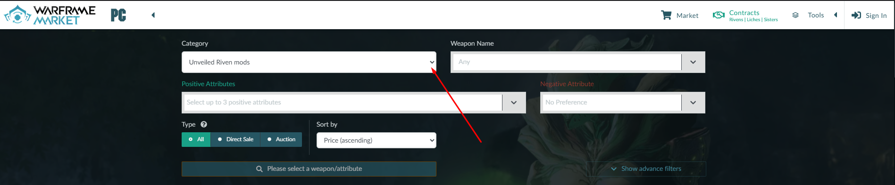

## How to use contracts of Warframe Market.

*This insctruction will help you to buy riven mods in contracts section of Warframe Market.*

### 1. Log in

Log in via your login and password in to the market by pressing `Sign in` button.

### 2. Contracts section.

Go to contracts section by pressing `Contracts` button.

### 3. Choose category.

Choose Unveiled Riven mods by pressing `Category` accordeon.

