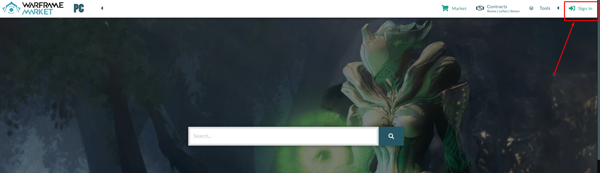
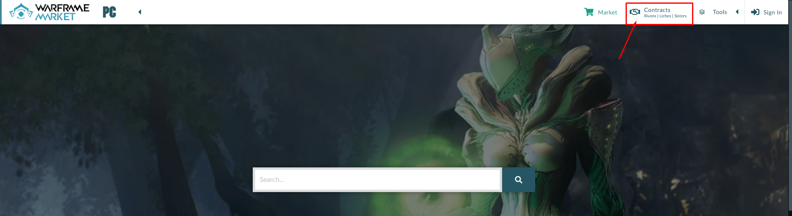
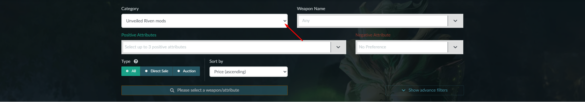
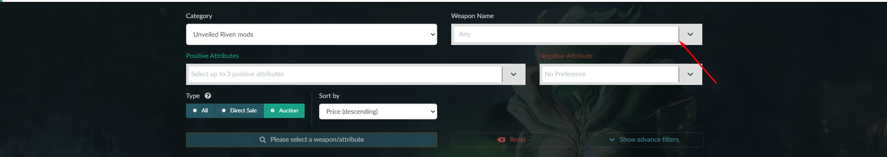
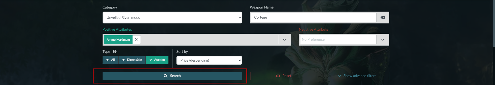

## How to use contracts of Warframe Market.

*This insctruction will help you to buy riven mods in contracts section of Warframe Market.*

### 1. Log in

Log in via your login and password in to the market by pressing `Sign In` button.

### 2. Contracts section.

Go to contracts section by pressing `Contracts` button.

#### 2.1 Select category.

Select Unveiled Riven mods by pressing `Category` accordeon.

#### 2.2 Select Positive attributes.

Select the attributes you are interested in by pressing `Positive Attributes` accordeon.

#### 2.3 Select weapon.

Select weapon name you are interested in by pressing `Weapon Name` accordeon or type weapon name in search bar.

#### 2.4 Search mode.

After you finish with neccesarry elements as category, positive attributes, weapon name you can start searching your riven mode by pressing `Search` button.

### 3. Additional tools of searching.